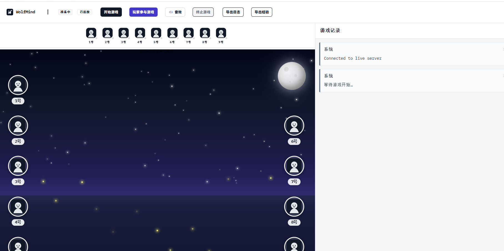
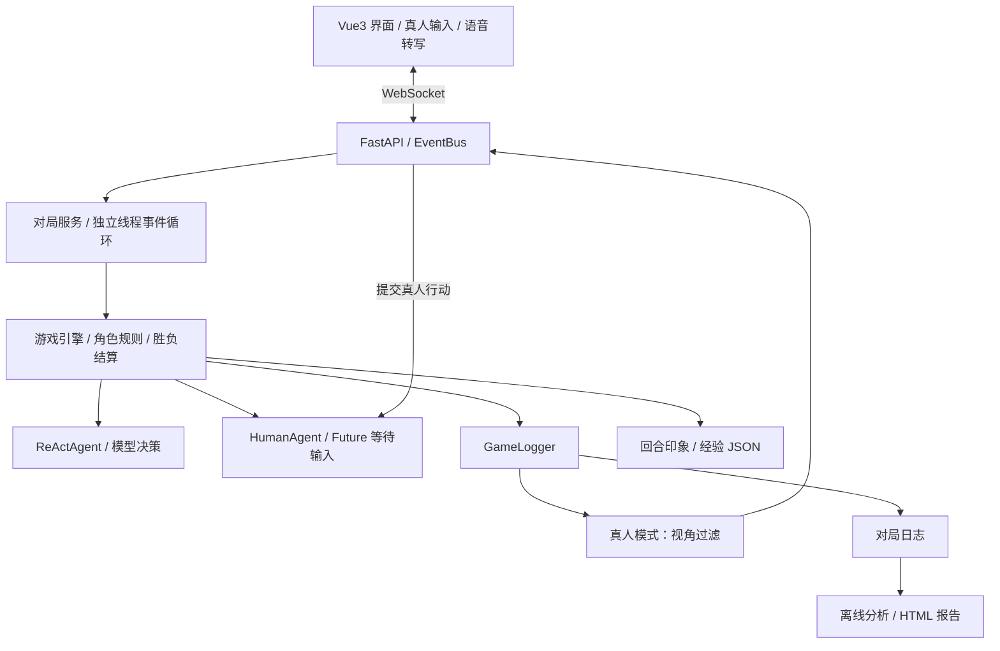

# WolfMind-Agent：支持真人参与的多智能体狼人杀

基于 AgentScope 的 9 人狼人杀系统，支持 **9 个 AI 自动博弈** 与 **8 个 AI + 1 位真人同场对战**。通过 Web 界面观察发言、投票和角色行动，也可以亲自加入对局，用文字或语音转写参与讨论。

> 本项目由 [Melodyfuhua](https://github.com/Melodyfuhua) 基于原作者 [KeLuoJun](https://github.com/KeLuoJun) 的 [WolfMind](https://github.com/KeLuoJun/WolfMind) 二次开发。原项目提供了多智能体狼人杀引擎、角色逻辑、日志与分析等基础能力；本仓库在此基础上扩展真人参与、真人视角过滤及交互体验。感谢原作者的开源工作，原始版权声明保留在 [LICENSE](LICENSE) 中。

## 本版本的功能扩展

### 真人与 AI 同场博弈

- 新增 `HumanAgent`，通过统一的 Agent 调用与消息接口替换一个 AI 座位，复用现有游戏流程。
- 真人随机分配座位与角色，支持发言、投票以及对应角色的技能选择。
- 根据决策 Schema 生成输入项，通过 WebSocket 提交行动。
- 游戏运行在独立线程事件循环中，使用 `asyncio.Future` 等待真人输入，并通过 `call_soon_threadsafe` 跨线程唤醒。

### 真人视角与私密信息过滤

- 在服务端按真人座位和角色过滤引擎事件，再传入前端事件流。
- 隐藏其他玩家身份；真人为狼人时，可以识别狼人队友并查看狼人频道。
- 预言家查验、女巫用药等夜间私密行动按角色控制可见性。
- 剥离其他玩家的私密心声与反思，过滤后的引擎事件同时用于实时展示与历史缓冲。

### 文字、语音与氛围交互

- 真人输入面板支持文字发言和行动选择。
- 集成浏览器 Web Speech API，将语音转写成文字后提交；可用性取决于浏览器与麦克风权限。
- 支持昼夜背景音、事件音效和静音控制；音频文件不可用时使用 Web Audio 合成音作为回退。

## 系统已有能力

以下能力在原项目基础上保留并集成：

- **完整对局流程**：3 狼人、3 村民、1 预言家、1 女巫、1 猎人；包含夜间行动、白天讨论、投票、平票 PK、遗言与胜负判定。
- **结构化决策**：通过 Pydantic Schema 与 AgentScope 的结构化输出机制，获取心声 `thought`、表现 `behavior`、发言 `speech` 及行动字段。三个字段属于一次决策输出，不是三次独立推理调用。
- **分组通信**：利用 MsgHub 组织公共讨论与狼人私聊，手动广播经过私密字段过滤的消息。
- **回合反思**：更新玩家之间的文字印象与策略经验，并注入后续回合上下文。
- **经验存档**：将经验持久化为 JSON。当前默认每次开局创建空存档，尚未自动恢复上一局经验。
- **实时观战**：FastAPI + WebSocket 推送游戏事件，Vue3 展示玩家状态、讨论和投票过程。
- **日志分析**：保存对局日志，支持通过独立分析流程生成心理与社交关系 HTML 报告。
- **多模型接入**：支持 DashScope、OpenAI 兼容接口与 Ollama；OpenAI 模式支持按玩家分别配置模型。

## 界面展示

### 游戏准备界面

连接本地服务后的初始页面，包含九人座位布局、AI 对局与真人参与入口、音效控制以及游戏记录面板。



后续将补充 AI 对局过程与真人行动面板截图。

## 技术架构



引擎负责确定的规则和状态转换，Agent 负责在合法行动范围内生成决策。Agent 间的信息分发与浏览器事件推送分别处理。

## 本地运行

### 环境

- Python **3.13+**，以 `pyproject.toml` 为准。
- Node.js **22.12+** 与 npm，适配当前前端 Vite 依赖。
- [uv](https://docs.astral.sh/uv/)。
- 一个可用的模型服务及相应配置。

### 1. 获取代码并安装依赖

```bash
git clone https://github.com/Melodyfuhua/WolfMind-Agent.git
cd WolfMind-Agent
npm run setup:all
```

### 2. 配置模型

将根目录 `.env.example` 复制为 `.env`，填写模型信息。Windows PowerShell：

```powershell
Copy-Item .env.example .env
```

例如使用 OpenAI 兼容接口：

```dotenv
MODEL_PROVIDER=openai
OPENAI_PLAYER_MODE=single
OPENAI_API_KEY=your_api_key
OPENAI_BASE_URL=https://your-provider.example/v1
OPENAI_MODEL_NAME=your_model_name
```

也可以选择 `MODEL_PROVIDER=dashscope` 或 `MODEL_PROVIDER=ollama`，配置项见 `.env.example`。模型服务需要兼容项目使用的工具调用与结构化输出机制。

`.env` 已加入 Git 忽略规则，请勿将真实密钥写入源码或提交到仓库。

### 3. 启动前后端

```bash
npm run dev
```

- 前端：http://localhost:5173
- 后端健康检查：http://localhost:8000/health
- API 文档：http://localhost:8000/docs

也可以在两个终端分别运行：

```bash
npm run backend
npm run frontend
```

进入页面后选择 AI 对局或真人参与模式。启动页面不会自动开始对局；开始对局后会调用所配置的模型服务。

### 4. 构建前端

```bash
npm run build
```

### 5. 命令行对局与分析

仅运行 AI 对局：

```bash
uv run python backend/main.py
```

CLI 对局在启用 `AUTO_ANALYZE=true` 时，可在结束后自动生成分析报告。Web 启动流程当前没有接入自动报告生成；已有日志可以手动分析：

```bash
uv run python -m backend.analysis --log data/game_logs/game_xxxx.log --experience data/experiences/players_experience_xxxx.json
```

分析流程需要调用模型，默认输出到 `data/analysis_reports/`。

## 关键代码

| 文件 | 作用 |
| --- | --- |
| `backend/main.py` | 模型与 Agent 创建、CLI 入口 |
| `backend/core/game_engine.py` | 对局调度、广播、投票与反思 |
| `backend/models/roles.py` | 各角色行为与技能状态 |
| `backend/models/schemas.py` | 结构化决策与候选目标约束 |
| `backend/core/human_agent.py` | 真人代理、输入规格、异步等待与唤醒 |
| `backend/core/perspective.py` | 真人视角事件过滤 |
| `backend/game_service.py` | AI / 真人对局创建与组装 |
| `backend/api_server.py` | HTTP 接口、线程管理、事件总线与 WebSocket |
| `backend/core/knowledge_base.py` | 策略经验存档 |
| `backend/analysis/` | 日志解析与报告生成 |
| `frontend/src/components/HumanInputPanel.vue` | 真人行动面板与语音转写 |
| `frontend/src/services/audio.js` | 背景音与事件音效 |

## 当前范围与后续方向

当前版本面向本地演示和多智能体实验，同一服务运行一局游戏，真人模式支持一位玩家。视角过滤已覆盖主要引擎事件，但尚未实现完整的连接鉴权、座位绑定、所有读取接口的统一权限及多房间隔离。

后续可以继续完善：

- 真人输入的服务端校验、超时处理与断线恢复。
- 实时事件、历史回放、日志导出与画像接口的统一可见性控制。
- 按对局隔离历史事件，增加事件序号和重连补发。
- 跨局经验恢复、经验质量评估与错误记忆纠正。
- Token、延迟、对局完成率及有无反思机制的对照评估。

## 致谢与许可证

- 原作者：[KeLuoJun](https://github.com/KeLuoJun)
- 原项目：[KeLuoJun/WolfMind](https://github.com/KeLuoJun/WolfMind)
- 二次开发与维护：[Melodyfuhua](https://github.com/Melodyfuhua)
- 多智能体框架：[AgentScope](https://github.com/modelscope/agentscope)

本仓库保留原项目的 [MIT 许可证及版权声明](LICENSE)。请在使用、复制和分发时保留相应声明。
